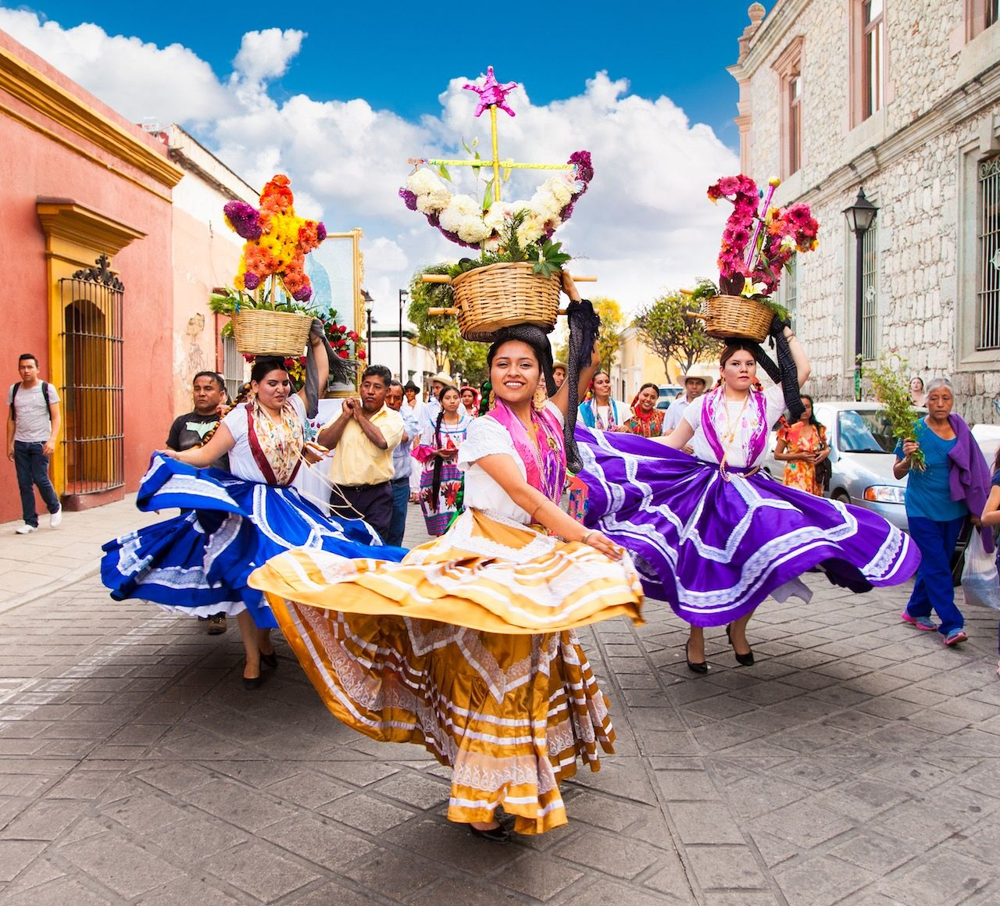

# 02.4 - `display` y flujo del documento
Hasta ahora hemos trabajado con cajas individuales:

```html
HTML
 ↓
elemento
 ↓
caja
 ↓
content + padding + border + margin
```

Pero falta responder una pregunta:

> **¿Cómo decide CSS dónde colocar cada caja respecto a las demás?**

Ahí entra el flujo normal del documento y la propiedad `display`.

## 1. El flujo normal

Cuando escribimos HTML:
```html
<body>
    <h1>Viajia</h1>
    <p>Descubre eventos.</p>
    <button>Explorar</button>
</body>
```

y no hemos aplicado ningún sistema de layout especial, el navegador coloca los elementos siguiendo unas reglas predeterminadas.

Por ejemplo:
```text
┌──────────────────────────────┐
│ Viajia                       │
│                              │
│ Descubre eventos.            │
│                              │
│ [Explorar]                   │
└──────────────────────────────┘
```

No tuvimos que decir:
```css
top: ...
left: ...
```

El navegador simplemente sigue el **flujo normal**.

Una de las cosas que determina cómo participa un elemento en ese flujo es:
```css
display
```

## 2. `display: block`

Muchos elementos HTML tienen comportamiento block por defecto.

Por ejemplo:
```html
<h1>Viajia</h1>
<p>Explora Oaxaca</p>
<article>Guelaguetza</article>
```

Conceptualmente:
```text
┌─────────────────────────────┐
│ Viajia                      │
└─────────────────────────────┘
┌─────────────────────────────┐
│ Explora Oaxaca              │
└─────────────────────────────┘
┌─────────────────────────────┐
│ Guelaguetza                 │
└─────────────────────────────┘
```

Cada elemento empieza en una nueva línea.

Algunos elementos que normalmente son `block`:
```text
div
p
h1-h6
section
article
header
main
footer
nav
```

Esto es importante para Viajia porque muchas de nuestras estructuras serán precisamente:
```html
<section>
    <article>...</article>
    <article>...</article>
    <article>...</article>
</section>
```

## 3. `display: inline`

Otros elementos tienen comportamiento `inline`.

Por ejemplo:
```html
<p>
    Visita
    <a href="/events">nuestros eventos</a>
    en Oaxaca.
</p>
```

El enlace no genera una nueva línea:
```text
Visita nuestros eventos en Oaxaca.
       └─────────────────┘
             <a>
```

Algunos elementos que normalmente son inline:
```text
a
span
strong
em
```

La diferencia conceptual:
```text
block
──────────────────────
[ elemento completo ]
──────────────────────
[ siguiente elemento ]
──────────────────────

inline

texto [elemento] texto [elemento] texto
```

## 4. display: inline-block

Ahora tenemos una opción intermedia:
```css
display: inline-block;
```

Un elemento `inline-block` participa en la línea como un elemento inline, pero conserva características de una caja que podemos dimensionar.

Por ejemplo:
```css
.event-card {
    display: inline-block;
    width: 300px;
}
```

Podríamos terminar teniendo:
```text
┌──────────────┐  ┌──────────────┐  ┌──────────────┐
│ Guelaguetza  │  │ Festival     │  │ Feria        │
│              │  │              │  │              │
│    300px     │  │    300px     │  │    300px     │
└──────────────┘  └──────────────┘  └──────────────┘
```

si existe suficiente espacio horizontal.

Esto ya empieza a parecerse a nuestro problema real:

> Tenemos varias tarjetas de eventos y queremos distribuirlas.

Pero no vamos a utilizar `inline-block` **para construir Viajia**. Es importante conocerlo porque forma parte del modelo de CSS, pero para layouts modernos utilizaremos principalmente **Flexbox y Grid**.

## 5. display: none

Existe otro valor importante:
```css
display: none;
```

Esto hace que el elemento **no participe en el layout**.

Por ejemplo:
```css
.event-card {
    display: none;
}
```

Es diferente de simplemente hacerlo invisible.
```css
visibility: hidden;
```

Con:
```css
display: none;
```

el elemento desaparece del flujo:
```text
Antes:

A
B
C


Después:

A
C
```

Mientras que con:
```css
visibility: hidden;
```

el espacio del elemento sigue existiendo:
```text
A
[ espacio de B ]
C
```

## 6. Algo importante: `display` no significa "posición"

Aquí quiero evitar una confusión común.

Esto:
```css
display: flex;
```

no significa:

> "Pon el elemento en determinada posición."

Significa:

> "Cambia la forma en que se distribuyen los elementos dentro de este contenedor."

Por ejemplo:
```css
.events {
    display: flex;
}
```

Si tenemos:
```html
<section class="events">
    <article>Guelaguetza</article>
    <article>Festival de Jazz</article>
    <article>Feria del Mezcal</article>
</section>
```

el `section` se convierte en un **flex container**.

Y sus hijos:
```text
section
 │
 ├── article
 ├── article
 └── article
```

se convierten en **flex items**.

Esto nos llevará al siguiente tema.

## 🧠 Una analogía con Android

Como vienes de Android, puedes empezar a hacer una asociación:
```text
CSS                         Conceptualmente
────────────────────────────────────────────
display: block              flujo vertical
display: inline             flujo dentro de texto
display: flex               sistema de distribución flexible
display: grid               sistema de distribución en filas/columnas
```

Pero **no quiero que pienses que** `display: flex` **es simplemente un equivalente de** `LinearLayout`. Hay similitudes conceptuales, pero Flexbox tiene su propio modelo y vale la pena aprenderlo correctamente.

## Ejemplo de ejercicio

```html
<!DOCTYPE html>
<head>
    <link rel="stylesheet" href="styles.css">
</head>
<body>
    <header>

    </header>
    <main>
        <section>
            <article class="event-card-block">
                
                <h2 class="event-title">
                    Guelaguetza
                </h2>
                <p class="event-description">
                    Festival cultural tradicional de Oaxaca
                </p>
                <button
                    type="button"
                    class="save-event-button"
                >
                    Guardar
                </button>
            </article>
            <article class="event-card-block">
                
                <h2 class="event-title">
                    Guelaguetza
                </h2>
                <p class="event-description">
                    Festival cultural tradicional de Oaxaca
                </p>
                <button
                    type="button"
                    class="save-event-button"
                >
                Guardar
                </button>
            </article>
            <article class="event-card-block">
                
                <h2 class="event-title">
                    Guelaguetza
                </h2>
                <p class="event-description">
                    Festival cultural tradicional de Oaxaca
                </p>
                <button
                    type="button"
                    class="save-event-button"
                >
                    Guardar
                </button>
            </article>
        </section>
        <section>
            <article class="event-card-inline">
                
                <h2 class="event-title">
                    Guelaguetza
                </h2>
                <p class="event-description">
                    Festival cultural tradicional de Oaxaca
                </p>
                <button
                    type="button"
                    class="save-event-button"
                >
                    Guardar
                </button>
            </article>
            <article class="event-card-inline">
                
                <h2 class="event-title">
                    Guelaguetza
                </h2>
                <p class="event-description">
                    Festival cultural tradicional de Oaxaca
                </p>
                <button
                    type="button"
                    class="save-event-button"
                >
                Guardar
                </button>
            </article>
            <article class="event-card-inline">
                
                <h2 class="event-title">
                    Guelaguetza
                </h2>
                <p class="event-description">
                    Festival cultural tradicional de Oaxaca
                </p>
                <button
                    type="button"
                    class="save-event-button"
                >
                    Guardar
                </button>
            </article>
        </section>
        <section>
            <article class="event-card-inline-block">
                
                <h2 class="event-title">
                    Guelaguetza
                </h2>
                <p class="event-description">
                    Festival cultural tradicional de Oaxaca
                </p>
                <button
                    type="button"
                    class="save-event-button"
                >
                    Guardar
                </button>
            </article>
            <article class="event-card-inline-block">
                
                <h2 class="event-title">
                    Guelaguetza
                </h2>
                <p class="event-description">
                    Festival cultural tradicional de Oaxaca
                </p>
                <button
                    type="button"
                    class="save-event-button"
                >
                Guardar
                </button>
            </article>
            <article class="event-card-inline-block">
                
                <h2 class="event-title">
                    Guelaguetza
                </h2>
                <p class="event-description">
                    Festival cultural tradicional de Oaxaca
                </p>
                <button
                    type="button"
                    class="save-event-button"
                >
                    Guardar
                </button>
            </article>
        </section>
        <section>
            <article class="event-card-inline-block">
                
                <h2 class="event-title">
                    Guelaguetza
                </h2>
                <p class="event-description">
                    Festival cultural tradicional de Oaxaca
                </p>
                <button
                    type="button"
                    class="save-event-button"
                >
                    Guardar
                </button>
            </article>
            <article class="event-card-inline-block">
                
                <h2 class="event-title">
                    Guelaguetza
                </h2>
                <p class="event-description">
                    Festival cultural tradicional de Oaxaca
                </p>
                <button
                    type="button"
                    class="save-event-button"
                >
                Guardar
                </button>
            </article>
            <article class="event-card-none">
                
                <h2 class="event-title">
                    Guelaguetza
                </h2>
                <p class="event-description">
                    Festival cultural tradicional de Oaxaca
                </p>
                <button
                    type="button"
                    class="save-event-button"
                >
                    Guardar
                </button>
            </article>
        </section>
    </main>
</body>
```
```css
.event-card-block {
    display: block;
    width: 300px;
    height: 200px;
    padding: 5px;
    margin: 5px;
    border: 1px solid purple;
    box-sizing: border-box;
}
.event-card-inline {
    display: inline;
    width: 300px;
    height: 200px;
    padding: 5px;
    margin: 5px;
    border: 1px solid purple;
    box-sizing: border-box;
}
.event-card-inline-block {
    display: inline-block;
    width: 300px;
    height: 200px;
    padding: 5px;
    margin: 5px;
    border: 1px solid purple;
    box-sizing: border-box;
}
.event-card-none {
    display: none;
    width: 300px;
    height: 200px;
    padding: 5px;
    margin: 5px;
    border: 1px solid purple;
    box-sizing: border-box;
}
```